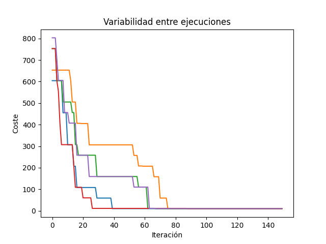

# Problema de Optimización de Cobertura utilizando Simulated Annealing
Ejercicio de búsqueda global donde se trata de optimizar el problema de abarcar el mayor número de estaciones de radio de USA (reducido).


## Descripción del Problema
Este proyecto aborda un problema clásico de optimización en Inteligencia Artificial conocido como "_Set Covering Problem_".

El objetivo es encontrar el número mínimo de estaciones de radio necesarias para cubrir todos los estados de Estados Unidos (específicamente, los estados del oeste y centro del país).

Está basado en el ejercicio propuesto en el capítulo 8 _Greedy Algorithms_ del libro grokking [_Algorithms: An illustrated guide for programmers and other curious people_ de Aditya Y. Bhargava](https://github.com/egonSchiele/grokking_algorithms)

## Instalación y Configuración

### Requisitos Previos
- Python ≥ 3.11
- [uv](https://github.com/astral-sh/uv) (gestor de paquetes de Python)

### Tkinter

`plt.show()` con Python 3.12 necesita un backend interactivo (TkAgg, Qt5Agg, Gtk3Agg) y una librería GUI instalada.

En Linux, por ejemplo:

`sudo apt-get install -y python3-tk` para TkAgg

o 

`pip install PyQt5` para Qt5Agg


### Instalación

1. Clonar el repositorio:
```bash
git clone https://github.com/Tresssco/Simulated-Annealing.git
cd Simulated-Annealing
```

2. Crear y activar un entorno virtual con uv:

```bash
python -m pip install uv

uv venv

source .venv/bin/activate  # En Linux/MacOS
# o
.venv\Scripts\activate     # En Windows
```

3. Instalar las dependencias:
```bash
uv sync
```

### Dependencias Principales
- matplotlib ≥ 3.10.1


### Uso

`uv run main.py`

o

`python3 main.py`


### Contexto
- Necesitamos cobertura de radio en un conjunto de estados, todos los situados al oeste del río Mississippi para promocionar el disco _country_ de Beyoncé _Cowboy Carter_.
- Existen varias estaciones de radio, cada una cubriendo diferentes conjuntos de estados.
- Queremos seleccionar el menor número de estaciones posible que cubran todos los estados requeridos, porque Beyoncé -en modo gano o muero- paga la promoción del disco de su bolsillo. Las estaciones al oeste del Misisipi tienen un código que empieza por la letra `K`.

### Cobertura de Estaciones

La siguiente tabla muestra los estados que cubre cada estación de radio:

| Estación   | Estados Cubiertos |
|------------|------------------|
| kone       | Idaho (ID), Nevada (NV), Utah (UT) |
| ktwo       | Washington (WA), Idaho (ID), Montana (MT) |
| kthree     | Oregon (OR), Nevada (NV), California (CA) |
| kfour      | Nevada (NV), Utah (UT) |
| kfive      | California (CA), Arizona (AZ) |
| ksix       | New Mexico (NM), Texas (TX), Oklahoma (OK) |
| kseven     | Oklahoma (OK), Kansas (KS), Colorado (CO) |
| keight     | Kansas (KS), Colorado (CO), Nebraska (NE) |
| knine      | Nebraska (NE), South Dakota (SD), Wyoming (WY) |
| kten       | North Dakota (ND), Iowa (IA) |
| keleven    | Minnesota (MN), Missouri (MO), Arkansas (AR) |
| ktwelve    | Louisiana (LA) |
| kthirteen  | Missouri (MO), Arkansas (AR) |


*K/W Call Letters in the United States*

 

*List of U.S. state and territory abbreviations*

## Implementación

El proyecto implementa una estrategia de búsqueda:

### Recocido Simulado (`simulated_annealing`)

1. Configuración: Se definen los estados a cubrir (objetivo) y qué estados cubre cada estación de radio (datos).
2. Función de Coste (`objetive_function`): Evalúa cada solución sumando una penalización alta por cada estado no cubierto y un punto por cada estación usada. El objetivo es minimizar este valor.
3. Búsqueda de Vecinos (`get_neighbor`): En cada iteración, el algoritmo modifica la solución actual añadiendo o quitando una estación al azar para explorar nuevas combinaciones.
4. Criterio de Aceptación:

    - Si el cambio mejora la cobertura, se acepta siempre.
    - Si el cambio empeora la cobertura, se puede aceptar de todos modos basándose en una probabilidad que depende de la Temperatura.

5. Enfriamiento: La temperatura disminuye gradualmente. Esto permite que al principio el algoritmo "salte" libremente para evitar trampas (mínimos locales) y al final se estabilice en la mejor solución encontrada.
6. Resultado: Tras completar las iteraciones, el código devuelve la combinación más eficiente de estaciones que logra la máxima cobertura.




- La gráfica muestra 5 ejecuciones independientes, cada una representada por un color diferente. 
- La variabilidad inicial que se observa en la gráfica representa la fase de exploración (alta temperatura), mientras que la estabilización final representa la explotación de la mejor solución encontrada.

## Resultados

- A pesar de que el algoritmo comienza con puntos de inicio distintos, todas las ejecuciones convergen hacia un coste mínimo similar. Esto demuestra la eficacia del enfriamiento para escapar de mínimos locales.
- En el 100% de las pruebas realizadas para este conjunto de datos, se logra alcanzar la solución óptima.
- Aunque la ruta de búsqueda varía, el algoritmo es sumamente rápido: usualmente se alcanza el estado estable en menos de 100 iteraciones, mucho antes de agotar las 2000 programadas.


## Referencias

- El enunciado de este problema fue proporcionado por @dfleta en el repositorio https://github.com/dfleta/greedy-search.git 
- Para la estructura del código me basé en: https://www.geeksforgeeks.org/dsa/implement-simulated-annealing-in-python/ 


